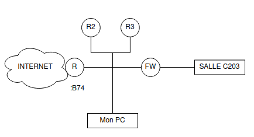

# ipv6-tp1

## 1- Réseau IPv6 IUT

### Question 1
*Installer tous les outils réseaux manquant dans la liste indiquée dans l’en-tête du TP*

```
# apt install miredo radvd radvdump isc-dhcp-server
```

### Question 2
*Vérifier qu’IPv6 est bien compilé dans votre kernel linux et commentez le résultat*

```
# grep CONFIG_IPV6 /boot/config-$(uname -r)
CONFIG_IPV6=y
CONFIG_IPV6_ROUTER_PREF=y
CONFIG_IPV6_ROUTE_INFO=y
# CONFIG_IPV6_OPTIMISTIC_DAD is not set
CONFIG_IPV6_MIP6=m
CONFIG_IPV6_ILA=m
CONFIG_IPV6_VTI=m
CONFIG_IPV6_SIT=m
CONFIG_IPV6_SIT_6RD=y
CONFIG_IPV6_NDISC_NODETYPE=y
CONFIG_IPV6_TUNNEL=m
CONFIG_IPV6_GRE=m
CONFIG_IPV6_FOU=m
CONFIG_IPV6_FOU_TUNNEL=m
CONFIG_IPV6_MULTIPLE_TABLES=y
CONFIG_IPV6_SUBTREES=y
CONFIG_IPV6_MROUTE=y
CONFIG_IPV6_MROUTE_MULTIPLE_TABLES=y
CONFIG_IPV6_PIMSM_V2=y
CONFIG_IPV6_SEG6_LWTUNNEL=y
CONFIG_IPV6_SEG6_HMAC=y
CONFIG_IPV6_SEG6_BPF=y
# CONFIG_IPV6_RPL_LWTUNNEL is not set
```

### Question 3
*Arrêter maintenant la gestion automatique du réseau sur votre système*

```
# systemctl stop NetworkManager
```

### Question 4
*Brancher physiquement votre machine sur le switch correspondant au réseau IPv6 de l’IUT*

### Question 5
*Activer la prise en compte des trames RA (Router Advertisement) sur votre interface Ethernet (voir  sysctl
net.ipv6.conf.xxx)*

Ici xxx est l'interface réseau en question, ici mon interface s'apelle `enp0s31f6`

```
# sysctl -w net.ipv6.conf.enp0s31f6.accept_ra=1
net.ipv6.conf.enp0s31f6.accept_ra = 1

# sysctl -w net.ipv6.conf.enp0s31f6.use_tempaddr=0
net.ipv6.conf.enp0s31f6.use_tempaddr = 0

# sysctl -w net.ipv6.conf.enp0s31f6.addr_gen_mode=0
net.ipv6.conf.enp0s31f6.addr_gen_mode = 0
```

### Question 6
*Comment afficher les propriétés de la carte réseau avec la commande ip ? Notez et expliquez vos adresses IPv6*

```
# ip -6 a
1: lo: <LOOPBACK,UP,LOWER_UP> mtu 65536 state UNKNOWN qlen 1000
    inet6 ::1/128 scope host 
       valid_lft forever preferred_lft forever
2: enp0s31f6: <BROADCAST,MULTICAST,UP,LOWER_UP> mtu 1500 state UP qlen 1000
    inet6 2001:660:6306:1000:b27b:25ff:fe26:9f63/64 scope global dynamic mngtmpaddr 
       valid_lft 2591989sec preferred_lft 604789sec
    inet6 fe80::b27b:25ff:fe26:9f63/64 scope link 
       valid_lft forever preferred_lft forever
```

- Une IPv6 en scope global dynamic mngtmpaddr
>`2001:660:6306:1000:b27b:25ff:fe26:9f63/64`

- Une IPv6 en scope link
>`fe80::b27b:25ff:fe26:9f63/64`

### Question 7
*Comment n’afficher que les adresses IPv6 avec la commande ip ?*

Pour n'afficher ue les addresses IPv6, je vais utiliser l'option `-6` de la commande ip

```
# ip -6 a
1: lo: <LOOPBACK,UP,LOWER_UP> mtu 65536 state UNKNOWN qlen 1000
    inet6 ::1/128 scope host 
       valid_lft forever preferred_lft forever
2: enp0s31f6: <BROADCAST,MULTICAST,UP,LOWER_UP> mtu 1500 state UP qlen 1000
    inet6 2001:660:6306:1000:b27b:25ff:fe26:9f63/64 scope global dynamic mngtmpaddr 
       valid_lft 2591936sec preferred_lft 604736sec
    inet6 fe80::b27b:25ff:fe26:9f63/64 scope link 
       valid_lft forever preferred_lft forever
```

### Question 8
*Afficher le contenu du fichier /proc/net/if_inet6 et commenter le résultat*

```
# cat /proc/net/if_inet6
fe80000000000000b27b25fffe269f63 02 40 20 80 enp0s31f6
00000000000000000000000000000001 01 80 10 80       lo
fe800000000000000042f9fffe0af09f 03 40 20 80 br-8eb90b05e065
2001066063061000b27b25fffe269f63 02 40 00 00 enp0s31f6
```

Je retrouve dans ce fichier :
- L'adresse IPv6 sans séparateurs
- Le numéro de l'interface
- La longueur du préfixe en héxa
- La valeur du scope
- Le "flag" de l'interface
- Le nom de l'interface

Par exemple, ici je retrouve bien les 2 @IPv6 de mon interface `enp0s31f6`, c'est à dire la seconde interface dans la liste du retour de commande `ip`.

### Question 9
*Qu’obtient-on si on fixe use_tempaddr à 2 et address_gen_mode à 3 ? Commenter les résultats*

Je commence par modifer les valeurs demandées

```
# sysctl -w net.ipv6.conf.enp0s31f6.use_tempaddr=2
# sysctl -w net.ipv6.conf.enp0s31f6.addr_gen_mode=3
```

Puis je vérifie le contenu du fichier if_inet6

```
# cat /proc/net/if_inet6fe80000000000000b27b25fffe269f63 02 40 20 80 enp0s31f6
fe800000000000002fc9af1c6f00ea47 02 40 20 80 enp0s31f6
00000000000000000000000000000001 01 80 10 80       lo
fe800000000000000042f9fffe0af09f 03 40 20 80 br-8eb90b05e065
2001066063061000261a10a6273c2c85 02 40 00 01 enp0s31f6
2001066063061000eddfcbadc4411530 02 40 00 00 enp0s31f6
2001066063061000b27b25fffe269f63 02 40 00 00 enp0s31f6
```

Après avoir changé les valeurs, des nouvelles lignes sont apparues pour l'interface en question, la longueur de l'IPv6 et le nom de l'interface restent inchangés. Cependant l'@IPv6, la valeur du scope et le "flag" de l'interface ont changé.

```
# ip -6 a
1: lo: <LOOPBACK,UP,LOWER_UP> mtu 65536 state UNKNOWN qlen 1000
    inet6 ::1/128 scope host 
       valid_lft forever preferred_lft forever
2: enp0s31f6: <BROADCAST,MULTICAST,UP,LOWER_UP> mtu 1500 state UP qlen 1000
    inet6 2001:660:6306:1000:261a:10a6:273c:2c85/64 scope global temporary dynamic 
       valid_lft 604499sec preferred_lft 85510sec
    inet6 2001:660:6306:1000:eddf:cbad:c441:1530/64 scope global dynamic mngtmpaddr stable-privacy 
       valid_lft 2591707sec preferred_lft 604507sec
    inet6 2001:660:6306:1000:b27b:25ff:fe26:9f63/64 scope global dynamic mngtmpaddr 
       valid_lft 2587875sec preferred_lft 600675sec
    inet6 fe80::2fc9:af1c:6f00:ea47/64 scope link stable-privacy 
       valid_lft forever preferred_lft forever
    inet6 fe80::b27b:25ff:fe26:9f63/64 scope link 
       valid_lft forever preferred_lft forever
```

Dans la liste des adresses, 3 nouvelles IPs ont été ajouté et le type `stable-privacy` est apparu.

### Question 10
Comment afficher la table de routage IPv6 avec la commande ip ?

```
# ip -6 r
::1 dev lo proto kernel metric 256 pref medium
2001:660:6306:1000::/64 dev enp0s31f6 proto kernel metric 256 expires 2591419sec pref medium
fe80::/64 dev enp0s31f6 proto kernel metric 100 pref medium
fe80::/64 dev br-8eb90b05e065 proto kernel metric 256 linkdown pref medium
fe80::/64 dev enp0s31f6 proto kernel metric 256 pref medium
default via fe80::726d:15ff:fec9:b74 dev enp0s31f6 proto ra metric 1024 expires 1219sec hoplimit 64 pref medium
```

### Question 11

```
# sudo tcpdump -n -i enp0s31f6 icmp6
...
13:56:32.753651 IP6 fe80::726d:15ff:fec9:b74 > ff02::1: ICMP6, router advertisement, length 64
13:56:33.080135 IP6 fe80::f7df:e4f2:be97:680d > ff02::2: ICMP6, router solicitation, length 16
```

```
# radvdump
#
# radvd configuration generated by radvdump 2.17
# based on Router Advertisement from fe80::726d:15ff:fec9:b74
# received by interface enp0s31f6
#

interface enp0s31f6
{
        AdvSendAdvert on;
        # Note: {Min,Max}RtrAdvInterval cannot be obtained with radvdump
        AdvManagedFlag off;
        AdvOtherConfigFlag off;
        AdvReachableTime 0;
        AdvRetransTimer 0;
        AdvCurHopLimit 64;
        AdvDefaultLifetime 1800;
        AdvHomeAgentFlag off;
        AdvDefaultPreference medium;
        AdvSourceLLAddress on;
        AdvLinkMTU 1500;

        prefix 2001:660:6306:1000::/64
        {
                AdvValidLifetime 2592000;
                AdvPreferredLifetime 604800;
                AdvOnLink on;
                AdvAutonomous on;
                AdvRouterAddr off;
        }; # End of prefix definition

}; # End of interface definition
```

Grâce aux commandes tcpdump et radvdump, j'ai pu trouver :
- l'IPv6 du routeur de sortie de l'IUT
`fe80::726d:15ff:fec9:b74`
- le préfixe IPv6 de l'IUT `2001:660:6306:1000::/64`

### Question 12
*Tester la liaison à un des DNS publics*

```
# ping6 -c1 2001:4860:4860::8888
PING 2001:4860:4860::8888(2001:4860:4860::8888) 56 data bytes
64 octets de 2001:4860:4860::8888 : icmp_seq=1 ttl=117 temps=8.03 ms

--- statistiques ping 2001:4860:4860::8888 ---
1 paquets transmis, 1 reçus, 0 % paquets perdus, temps 0 ms
rtt min/avg/max/mdev = 8.025/8.025/8.025/0.000 ms
```

```
# ping6 -c1 2620:119:35::35
PING 2620:119:35::35(2620:119:35::35) 56 data bytes
64 octets de 2620:119:35::35 : icmp_seq=1 ttl=55 temps=17.3 ms

--- statistiques ping 2620:119:35::35 ---
1 paquets transmis, 1 reçus, 0 % paquets perdus, temps 0 ms
rtt min/avg/max/mdev = 17.332/17.332/17.332/0.000 ms
```

De mon côté les DNS publics d'OpenDNS et de Google fonctionnment parfaitement.

### Question 13
*Afficher la liste des routeurs traversés pour aller jusqu’à un de ces serveurs*

```
# traceroute6 -n 2001:4860:4860::8888
traceroute to 2001:4860:4860::8888 (2001:4860:4860::8888) de 2001:660:6306:1000:e248:bebf:d2ac:e86f, 30 sauts max, 24 paquets d’octets
 1  2001:660:6306:1000::1  8,7755 ms  1,1203 ms  0,7704 ms
 2  ::ffff:100.75.85.254  3,2178 ms  3,0852 ms  4,0957 ms
 3  ::ffff:10.0.100.4  3,4744 ms  3,8633 ms  5,4397 ms
 4  2001:660:7904:247:1::1  3,9186 ms  5,0271 ms  3,9440 ms
 5  2001:660:7904:247:1::  4,4778 ms  3,2171 ms  4,0531 ms
 6  2001:660:7903:6000:1::191  5,7760 ms  5,2402 ms  9,0249 ms
 7  2001:660:7903:179:2::2  7,6886 ms  7,3831 ms  7,2298 ms
 8  2001:4860:1:1::696  8,4311 ms  9,6274 ms  10,2318 ms
 9  2001:4860:0:1b::1  7,7223 ms  8,6527 ms  10,3281 ms
10  2001:4860:0:1::2d4f  11,1222 ms  10,1114 ms  9,6866 ms
11  2001:4860:4860::8888  7,7274 ms  7,9535 ms  7,1444 ms
```

Ici 

### Question 14
*Modifier alors le(s) DNS de votre système avec resolvctl et la sous-commande dns*

```
$ resolvectl dns enp0s31f6 2001:4860:4860::8888
```

```
$ ping6 -c1 google.fr
PING google.fr(mrs09s13-in-x03.1e100.net (2a00:1450:4006:810::2003)) 56 data bytes
64 octets de mrs09s13-in-x03.1e100.net (2a00:1450:4006:810::2003) : icmp_seq=1 ttl=117 temps=5.35 ms

--- statistiques ping google.fr ---
1 paquets transmis, 1 reçus, 0 % paquets perdus, temps 0 ms
rtt min/avg/max/mdev = 5.347/5.347/5.347/0.000 ms
```

### Question 15
*Vérifier ensuite l’adresse IPv6 publique de votre poste*

`2001:660:6306:1000:e248:bebf:d2ac:e86f`

```
$ ip -6 a s enp0s31f6
...
    inet6 2001:660:6306:1000:e248:bebf:d2ac:e86f/64 scope global temporary dynamic 
       valid_lft 603152sec preferred_lft 84163sec
...
```

### Question 16
*Trouver l’adresse IPv6 de www.google.com en utilisant l’outil dig et le type AAAA*

```
$ dig www.google.com aaaa

;; ANSWER SECTION:
www.google.com.         291     IN      AAAA    2a00:1450:4006:812::2004
```

### Question 17
*Vérifier le préfixe de l’Université d’Aix-Marseille en cherchant une adresse IPv6 du domaine univ-amu.fr et en
recherchant dans la base de données du RIPE*

```
# dig ns univ-amu.fr

;; ANSWER SECTION:
univ-amu.fr.            21276   IN      NS      cnudns.cines.fr.
univ-amu.fr.            21276   IN      NS      ns1.univmed.fr.
```

```
# dig aaaa ns1.univmed.fr cnudns.cines.fr

;; ANSWER SECTION:
ns1.univmed.fr.         7012    IN      AAAA    2001:660:5402:801::1

cnudns.cines.fr.        3600    IN      AAAA    2001:660:6301:301::2:1
```

```
    inet6num:        2001:660:5402::/48
    netname:         FR-U-MEDITERRANEE
    descr:           Universite de la Mediterranee
    country:         FR
    admin-c:         BT261-RIPE
    admin-c:         RB178-RIPE
    tech-c:          PL1032-RIPE
    tech-c:          DL253-RIPE
    status:          ASSIGNED
    mnt-by:          RENATER-MNT
    remarks:         changed: rensvp@renater.fr 20040614
    created:         2004-06-22T15:07:26Z
    last-modified:   2015-08-06T16:03:00Z
    source:          RIPE

    route6:          2001:660::/32
    descr:           RENATER
    origin:          AS2200
    mnt-by:          RENATER-MNT
    remarks:         changed: rensvp@renater.fr 20050303
    created:         2005-03-07T15:22:03Z
    last-modified:   2015-08-07T13:30:17Z
    source:          RIPE
```

```
    net6num:        2001:660:6301::/48
    netname:         FR-CINES-MONTPELLIER
    descr:           Centre Informatique de l'Enseignement Superieur
    country:         FR
    admin-c:         BT261-RIPE
    admin-c:         MG1844-RIPE
    tech-c:          PM194-RIPE
    status:          ASSIGNED
    mnt-by:          RENATER-MNT
    remarks:         changed: rensvp@renater.fr 20021118
    remarks:         changed: rensvp@renater.fr 20090928
    created:         2002-12-03T18:24:53Z
    last-modified:   2015-08-06T16:11:01Z
    source:          RIPE

    route6:          2001:660::/32
    descr:           RENATER
    origin:          AS2200
    mnt-by:          RENATER-MNT
    remarks:         changed: rensvp@renater.fr 20050303
    created:         2005-03-07T15:22:03Z
    last-modified:   2015-08-07T13:30:17Z
    source:          RIPE
```

### Question 18
*Trouver le préfixe IPv6 utilisé par les serveurs du laboratoire LIP6 (lip6.fr) et vérifier qu’il est bien rattaché à
Sorbonne Université (Anciennement Université Pierre et Marie CURIE)*

```
# dig ns lip6.fr

;; ANSWER SECTION:
lip6.fr.		21600	IN	NS	osiris.lip6.fr.
lip6.fr.		21600	IN	NS	isis.lip6.fr.
lip6.fr.		21600	IN	NS	soleil.uvsq.fr.
```

```
# dig aaaa osiris.lip6.fr isis.lip6.fr soleil.uvsq.fr

;; ANSWER SECTION:
osiris.lip6.fr.		21600	IN	AAAA	2001:660:3302:283c::1e
isis.lip6.fr.		21600	IN	AAAA	2001:660:3302:283c::2
```

De mon côté, soleil.uvsq.fr ne retourne aucune IPv6.

```
    inet6num:        2001:660:3302::/48
    netname:         FR-U-PARIS6-RAP-10
    descr:           Universite Pierre et Marie CURIE
    country:         FR
    admin-c:         BT261-RIPE
    admin-c:         PB13606-RIPE
    tech-c:          RC2047-RIPE
    tech-c:          CH239-RIPE
    tech-c:          PLN16-RIPE
    status:          ASSIGNED
    mnt-by:          RENATER-MNT
    remarks:         changed: rensvp@renater.fr 20030327
    remarks:         changed: rensvp@renater.fr 20111114
    created:         2003-03-27T17:50:05Z
    last-modified:   2015-08-06T16:02:49Z
    source:          RIPE

    route6:          2001:660::/32
    descr:           RENATER
    origin:          AS2200
    mnt-by:          RENATER-MNT
    remarks:         changed: rensvp@renater.fr 20050303
    created:         2005-03-07T15:22:03Z
    last-modified:   2015-08-07T13:30:17Z
    source:          RIPE    
```

Je retrouve bien Pierre et Marie CURIE

### Question 19
*En utilisant wireshark, tshark ou tcpdump, capturer les trames icmp6 et les commenter. Vérifier l’adresse MAC
correspondant à une adresse IPv6 multicast*

J'ai utilisé l'outil wireshark afin de capturer les paquets icmpv6. Je peux retrouver des messages Multicast Listener Report Message v2

```
No.     Time           Source                Destination           Protocol Length Info
      3 0.625245       fe80::36e9:4266:2b22:48ee ff02::16              ICMPv6   250    Multicast Listener Report Message v2

Frame 3: 250 bytes on wire (2000 bits), 250 bytes captured (2000 bits)
Ethernet II, Src: b0:7b:25:26:9b:91 (b0:7b:25:26:9b:91), Dst: IPv6mcast_16 (33:33:00:00:00:16)
    Destination: IPv6mcast_16 (33:33:00:00:00:16)
        Address: IPv6mcast_16 (33:33:00:00:00:16)
        .... ..1. .... .... .... .... = LG bit: Locally administered address (this is NOT the factory default)
        .... ...1 .... .... .... .... = IG bit: Group address (multicast/broadcast)
    Source: b0:7b:25:26:9b:91 (b0:7b:25:26:9b:91)
        Address: b0:7b:25:26:9b:91 (b0:7b:25:26:9b:91)
        .... ..0. .... .... .... .... = LG bit: Globally unique address (factory default)
        .... ...0 .... .... .... .... = IG bit: Individual address (unicast)
    Type: IPv6 (0x86dd)
Internet Protocol Version 6, Src: fe80::36e9:4266:2b22:48ee, Dst: ff02::16
Internet Control Message Protocol v6
```

Ici pour chaque trame de type Multicast Listener Report Message v2, le destinataire s'apelle IPv6mcast_16 et ainsi a l'adresse MAC **33:33:00:00:00:16**

### Question 20
Expliquer et commenter le résultat de la commande ci-dessous par un schéma bien détaillé

`ping6 -I eth0 ff02::2`

Cette commande permet :
- De pinger une addresse IPv6 avec ping6
- De pinger sur l'interface eth0 avec -I
- De pinger l'@IP multicast n°2  ff02::2
- On peut rajouter l'option -c pour indiquer le nombre de sequences 

Lorsque j'essaye cette commande, j'ai un retour de commande avec 3 routeurs différents en dupliqué.

```
64 octets de fe80::a40b:dbff:febe:638b%enp0s31f6 : icmp_seq=1 ttl=64 temps=0.797 ms
64 octets de fe80::726d:15ff:fec9:b74%enp0s31f6 : icmp_seq=1 ttl=64 temps=0.797 ms (DUPLIQUÉ !)
64 octets de fe80::222:19ff:fe14:29e7%enp0s31f6 : icmp_seq=1 ttl=64 temps=0.797 ms (DUPLIQUÉ !)
64 octets de fe80::a40b:dbff:febe:638b%enp0s31f6 : icmp_seq=2 ttl=64 temps=1.13 ms
64 octets de fe80::222:19ff:fe14:29e7%enp0s31f6 : icmp_seq=2 ttl=64 temps=1.13 ms (DUPLIQUÉ !)
64 octets de fe80::726d:15ff:fec9:b74%enp0s31f6 : icmp_seq=2 ttl=64 temps=1.13 ms (DUPLIQUÉ !)
```



### Question 21
*Afficher ensuite la liste des voisins IPv6 avec la commande ip. Qu’obtient-on avec un ping vers FF02::1* 

J'affiche la liste des voisins IPv6 avec l'option neigh show de la commande ip. J'ai ici 21 voisins en STALE, 1 voisin en REACHABLE et 1 voisin FAILED

```
$ ip -6 neigh show
fe80::f9eb:8aaf:c69e:cdef dev enp0s31f6 lladdr b0:7b:25:26:a1:30 STALE
fe80::21e:bff:fe5a:2303 dev enp0s31f6 lladdr 00:1e:0b:5a:23:03 STALE
fe80::d6be:d9ff:fea9:4312 dev enp0s31f6 lladdr d4:be:d9:a9:43:12 STALE
fe80::d04d:5f24:7e57:12d3 dev enp0s31f6 lladdr 00:0c:29:d4:03:c0 STALE
fe80::529a:4cff:fe85:792b dev enp0s31f6 lladdr 50:9a:4c:85:79:2b STALE
fe80::4db:bbff:fe67:3812 dev enp0s31f6 lladdr 06:db:bb:67:38:12 STALE
fe80::b27b:25ff:fe26:a186 dev enp0s31f6 lladdr b0:7b:25:26:a1:86 STALE
fe80::214:22ff:fe75:b334 dev enp0s31f6 lladdr 00:14:22:75:b3:34 STALE
fe80::baca:3aff:fef5:975f dev enp0s31f6 lladdr b8:ca:3a:f5:97:5f STALE
fe80::baca:3aff:fef5:7783 dev enp0s31f6 lladdr b8:ca:3a:f5:77:83 STALE
fe80::30bc:1dff:fe36:57d2 dev enp0s31f6 lladdr 32:bc:1d:36:57:d2 STALE
fe80::b27b:25ff:fe26:9b91 dev enp0s31f6 lladdr b0:7b:25:26:9b:91 STALE
fe80::b032:c4b8:cb17:ade8 dev enp0s31f6 lladdr e0:d5:5e:ad:3f:86 STALE
fe80::9e5e:d0a:b70:5c56 dev enp0s31f6 lladdr b0:7b:25:26:9a:d9 STALE
fe80::2247:47ff:fe8d:9074 dev enp0s31f6 lladdr 20:47:47:8d:90:74 STALE
fe80::726d:15ff:fec9:b74 dev enp0s31f6 lladdr 70:6d:15:c9:0b:74 router REACHABLE
fe80::baca:3aff:fef5:8c43 dev enp0s31f6 lladdr b8:ca:3a:f5:8c:43 STALE
fe80::c2be:4bf0:5bf1:dbfc dev enp0s31f6  FAILED
fe80::20d:b4ff:fe15:a5f dev enp0s31f6 lladdr 00:0d:b4:15:0a:5f router STALE
fe80::222:19ff:fe14:29e7 dev enp0s31f6 lladdr 00:22:19:14:29:e7 router STALE
fe80::213:faff:fe04:72a6 dev enp0s31f6 lladdr 00:13:fa:04:72:a6 STALE
fe80::4db:bbff:fe67:4122 dev enp0s31f6 lladdr 06:db:bb:67:41:22 STALE
fe80::a40b:dbff:febe:638b dev enp0s31f6 lladdr a6:0b:db:be:63:8b router STALE
```

Par la suite en pinguant la multcast 1 j'ai un retour de 21 hôtes, ce qui correspond bel et bien au nombre de voisins en STALE

```
64 octets de fe80::d6be:d9ff:fea9:4312%enp0s31f6 : icmp_seq=1 ttl=64 temps=0.831 ms
64 octets de fe80::222:19ff:fe14:29e7%enp0s31f6 : icmp_seq=1 ttl=64 temps=1.14 ms (DUPLIQUÉ !)
64 octets de fe80::a40b:dbff:febe:638b%enp0s31f6 : icmp_seq=1 ttl=64 temps=1.14 ms (DUPLIQUÉ !)
64 octets de fe80::20d:b4ff:fe15:a5f%enp0s31f6 : icmp_seq=1 ttl=64 temps=1.24 ms (DUPLIQUÉ !)
64 octets de fe80::b27b:25ff:fe26:a186%enp0s31f6 : icmp_seq=1 ttl=64 temps=1.24 ms (DUPLIQUÉ !)
64 octets de fe80::c2be:4bf0:5bf1:dbfc%enp0s31f6 : icmp_seq=1 ttl=64 temps=1.24 ms (DUPLIQUÉ !)
64 octets de fe80::529a:4cff:fe85:792b%enp0s31f6 : icmp_seq=1 ttl=64 temps=1.46 ms (DUPLIQUÉ !)
64 octets de fe80::21e:bff:fe5a:2303%enp0s31f6 : icmp_seq=1 ttl=64 temps=1.46 ms (DUPLIQUÉ !)
64 octets de fe80::726d:15ff:fec9:b74%enp0s31f6 : icmp_seq=1 ttl=64 temps=1.77 ms (DUPLIQUÉ !)
64 octets de fe80::d04d:5f24:7e57:12d3%enp0s31f6 : icmp_seq=1 ttl=64 temps=1.78 ms (DUPLIQUÉ !)
64 octets de fe80::9e5e:d0a:b70:5c56%enp0s31f6 : icmp_seq=1 ttl=64 temps=2.11 ms (DUPLIQUÉ !)
64 octets de fe80::baca:3aff:fef5:8c43%enp0s31f6 : icmp_seq=1 ttl=64 temps=2.11 ms (DUPLIQUÉ !)
64 octets de fe80::baca:3aff:fef5:975f%enp0s31f6 : icmp_seq=1 ttl=64 temps=2.11 ms (DUPLIQUÉ !)
64 octets de fe80::baca:3aff:fef5:7783%enp0s31f6 : icmp_seq=1 ttl=64 temps=2.11 ms (DUPLIQUÉ !)
64 octets de fe80::213:faff:fe04:72a6%enp0s31f6 : icmp_seq=1 ttl=64 temps=2.11 ms (DUPLIQUÉ !)
64 octets de fe80::2247:47ff:fe8d:9074%enp0s31f6 : icmp_seq=1 ttl=64 temps=2.42 ms (DUPLIQUÉ !)
64 octets de fe80::4db:bbff:fe67:4122%enp0s31f6 : icmp_seq=1 ttl=64 temps=2.42 ms (DUPLIQUÉ !)
64 octets de fe80::4db:bbff:fe67:3812%enp0s31f6 : icmp_seq=1 ttl=64 temps=2.42 ms (DUPLIQUÉ !)
64 octets de fe80::f9eb:8aaf:c69e:cdef%enp0s31f6 : icmp_seq=1 ttl=64 temps=2.76 ms (DUPLIQUÉ !)
64 octets de fe80::30bc:1dff:fe36:57d2%enp0s31f6 : icmp_seq=1 ttl=64 temps=3.06 ms (DUPLIQUÉ !)
64 octets de fe80::214:22ff:fe75:b334%enp0s31f6 : icmp_seq=1 ttl=64 temps=4.63 ms (DUPLIQUÉ !)
```

### Question 22
*Comment manuellement désactiver la prise en compte des trames RA sur votre machine et effacer toutes les adresses IPv6
et fixer manuellement une adresse globale (plus simple à écrire) ? Vérifier qu’il n’y a pas de doublon (DAD, Duplicate
Address Detection) en affichant la configuration de la carte réseau plusieurs fois (commande ip a)*

```
# sysctl net.ipv6.conf.enp0s31f6.accept_ra=0
# ip a f dev enp0s31f6

# ip link set dev enp0s31f6 down
# ip link set dev enp0s31f6 up

# ip -6 a a 2001:660:6306:1000::420/64 dev enp0s31f6
# ip -6 a s dev enp0s31f6
2: enp0s31f6: <BROADCAST,MULTICAST,UP,LOWER_UP> mtu 1500 qdisc fq_codel state UP group default qlen 1000
    link/ether b0:7b:25:26:9f:63 brd ff:ff:ff:ff:ff:ff
    inet6 2001:660:6306:1000::420/64 scope global tentative 
       valid_lft forever preferred_lft forever
    inet6 fe80::2fc9:af1c:6f00:ea47/64 scope link stable-privacy 
       valid_lft forever preferred_lft forever
```

De mon côté il n'y a pas de conflits

### Question 23
*Comment ajouter la route par défaut et trouver la bonne adresse de routeur ? Tester votre connexion à l’internet*

Je peux retrouver l'adresse du routeur en faisant un `radvdump`, l'IP du routeur est `fe80::726d:15ff:fec9:b74` est donc sera la route par défaut

```
# ip r a default via fe80::726d:15ff:fec9:b74 dev enp0s31f6
```

Je vérifie si la route par défaut est bien rajoutée

```
# ip -6 r
::1 dev lo proto kernel metric 256 pref medium
2001:660:6306:1000::/64 dev enp0s31f6 proto kernel metric 256 pref medium
fe80::/64 dev br-8eb90b05e065 proto kernel metric 256 linkdown pref medium
fe80::/64 dev enp0s31f6 proto kernel metric 256 pref medium
default via fe80::726d:15ff:fec9:b74 dev enp0s31f6 metric 1024 pref medium
```

Maintenant je peux tester ma connexion Internet

```
# ping6 -c1 google.fr
PING google.fr(mrs09s13-in-x03.1e100.net (2a00:1450:4006:810::2003)) 56 data bytes
64 octets de mrs09s13-in-x03.1e100.net (2a00:1450:4006:810::2003) : icmp_seq=1 ttl=117 temps=5.49 ms

--- statistiques ping google.fr ---
1 paquets transmis, 1 reçus, 0 % paquets perdus, temps 0 ms
rtt min/avg/max/mdev = 5.491/5.491/5.491/0.000 ms
```

### Question 24
*Installer une application de ping IPv6 sur votre smartphone et tester la connexion vers votre machine.*

### Question 25
*Comment repasser en mode adressage IPv6 automatique ? Vérifier*

Il faut réactiver la prise en compte des trames RA sur la machine. Je commence par supprimer les adresses de mon interface

```
# sysctl net.ipv6.conf.enp0s31f6.accept_ra=1
net.ipv6.conf.enp0s31f6.accept_ra = 1
root@pc203-7:/home/test/ipv6# ip -6 a f dev enp0s31f6
root@pc203-7:/home/test/ipv6# ip link set dev enp0s31f6 down
root@pc203-7:/home/test/ipv6# ip link set dev enp0s31f6 up
```

Puis je vérifie après quelques dixaines de secondes

```
# ip -6 a s dev enp0s31f6
2: enp0s31f6: <BROADCAST,MULTICAST,UP,LOWER_UP> mtu 1500 qdisc fq_codel state UP group default qlen 1000
    inet6 2001:660:6306:1000:3e41:df1f:6c18:257e/64 scope global temporary dynamic 
       valid_lft 604663sec preferred_lft 85674sec
    inet6 2001:660:6306:1000:eddf:cbad:c441:1530/64 scope global dynamic mngtmpaddr stable-privacy 
       valid_lft 2591988sec preferred_lft 604788sec
    inet6 fe80::2fc9:af1c:6f00:ea47/64 scope link stable-privacy 
       valid_lft forever preferred_lft forever
```

## 2- Tunnel TEREDO sous Linux

### Question 1
*Désactiver la prise en compte des trames RA sur votre interface*

```
# sysctl net.ipv6.conf.enp0s31f6.accept_ra=0
```

### Question 2
*Effacer toutes ses adresses et la table de routage IPv6, puis lui ajouter une adresse IPv4*

> IP choisie : 194.199.227.220/24

Je supprime les adresses et la table de routage de l'interface

```
# ip -6 a f dev enp0s31f6
# ip -6 r f dev enp0s31f6
```

Puis j'ajoute l'IPv4 en question

```
# ip a a 194.199.227.220/24 dev enp0s31f6
```

Je peux aussi vérifier 

### Question 3
*Ajouter la route par défaut IPv4 vers le routeur de l’IUT et configurer un serveur DNS public*

J'ajoute la route par défaut à mon interface

```
# ip r a default via 194.199.227.254 dev enp0s31f6
```

Puis j'ajoute le serveur DNS publique de Google

```
# resolvectl dns enp0s31f6 8.8.8.8
```

Je peux vérifier si l'IP est bien rensignée

```
# resolvectl dns enp0s31f6
Link 2 (enp0s31f6): 8.8.8.8
```

Pour finir je teste la connexion

```
# ping -c1 google.fr
PING google.fr (172.217.19.35) 56(84) bytes of data.
64 octets de mrs08s03-in-f3.1e100.net (172.217.19.35) : icmp_seq=1 ttl=113 temps=8.23 ms

--- statistiques ping google.fr ---
1 paquets transmis, 1 reçus, 0 % paquets perdus, temps 0 ms
rtt min/avg/max/mdev = 8.228/8.228/8.228/0.000 ms
```

Tout fonctionne !

### Question 4
*Arrêter le service miredo pour lancer l’outil manuellement avec l’option -f dans une
console et vérifier qu’un tunnel se crée automatiquement. Quelles adresses sont utilisées ? Quelle est la table de routage
IPv6 ?*

Je commence par arreter le service

```
# systemctl stop miredo
```

Puis je relance le paquet avec l'option `-f`

```
# miredo -f
miredo[181038]: Démarrage...
miredo[181039]: Nouvelle adresse/MTU Teredo
miredo[181039]: Pseudo-tunnel Teredo démarré
miredo[181039]:  (adresse : 2001:0:c38c:c38c:1410:7050:3d38:1c23, MTU : 1280)
```

Je vais regarder la/les IPs générée(s)

```
# ip a s teredo
9: teredo: <POINTOPOINT,MULTICAST,NOARP,UP,LOWER_UP> mtu 1280 qdisc fq_codel state UNKNOWN group default qlen 500
    link/none 
    inet6 2001:0:c38c:c38c:1410:7050:3d38:1c23/32 scope global 
       valid_lft forever preferred_lft forever
    inet6 fe80::ffff:ffff:ffff/64 scope link 
       valid_lft forever preferred_lft forever
    inet6 fe80::9aa4:1469:ae5f:3973/64 scope link stable-privacy 
       valid_lft forever preferred_lft forever
```

3 IPv6 sont créées :
- 1 IPv6 en global
- 1 IPv6 en link
- 1 IPv6 en privacy

Voici la tabel de routage de l'interface
```
$ ip -6 r s dev teredo
2001::/32 proto kernel metric 256 pref medium
fe80::/64 proto kernel metric 256 pref medium
default metric 1029 pref medium
```

### Question 5
*Tester alors la connexion IPv6 vers un des serveurs DNS IPv6 et capturer les trames sur le tunnel et sur le port UDP 3544
de l’interface Ethernet. Commenter... Quel est le nom du serveur TEREDO utilisé ?*

Je ping à partie de l'interface de teredo vers le DNS de Google

```
$ ping -c3 -I teredo 2001:4860:4860::8888
PING 2001:4860:4860::8888(2001:4860:4860::8888) from 2001:0:c38c:c38c:3487:5f94:3d38:1c23 teredo: 56 data bytes
64 octets de 2001:4860:4860::8888 : icmp_seq=1 ttl=117 temps=150 ms
64 octets de 2001:4860:4860::8888 : icmp_seq=2 ttl=117 temps=55.0 ms
64 octets de 2001:4860:4860::8888 : icmp_seq=3 ttl=117 temps=57.5 ms

--- statistiques ping 2001:4860:4860::8888 ---
3 paquets transmis, 3 reçus, 0 % paquets perdus, temps 2001 ms
rtt min/avg/max/mdev = 54.989/87.463/149.933/44.184 ms
```

Et en même temps je fais une capture de trames pour récupérer ce dont j'ai besoin

```
No.     Time           Source                Destination           Protocol Length Info
    652 9.173367125    2001:0:c38c:c38c:3487:5f94:3d38:1c23 2001:4860:4860::8888  Teredo   108    Direct IPv6 Connectivity Test id=0xd6a5, seq=5906, hop limit=128

Frame 652: 108 bytes on wire (864 bits), 108 bytes captured (864 bits) on interface enp0s31f6, id 1
Ethernet II, Src: b0:7b:25:26:9f:63 (b0:7b:25:26:9f:63), Dst: Cisco_c9:0b:74 (70:6d:15:c9:0b:74)
Internet Protocol Version 4, Src: 194.199.227.220, Dst: 195.140.195.140
User Datagram Protocol, Src Port: 41067, Dst Port: 3544
    Source Port: 41067
    Destination Port: 3544
    Length: 74
    Checksum: 0x2e19 [unverified]
    [Checksum Status: Unverified]
    [Stream index: 47]
    [Timestamps]
Teredo IPv6 over UDP tunneling
Internet Protocol Version 6, Src: 2001:0:c38c:c38c:3487:5f94:3d38:1c23, Dst: 2001:4860:4860::8888
    0110 .... = Version: 6
    .... 0000 0000 .... .... .... .... .... = Traffic Class: 0x00 (DSCP: CS0, ECN: Not-ECT)
    .... .... .... 0000 0000 0000 0000 0000 = Flow Label: 0x00000
    Payload Length: 26
    Next Header: ICMPv6 (58)
    Hop Limit: 128
    Source: 2001:0:c38c:c38c:3487:5f94:3d38:1c23
    Destination: 2001:4860:4860::8888
    [Source Teredo Server IPv4: 195.140.195.140]
    [Source Teredo Port: 41067]
    [Source Teredo Client IPv4: 194.199.227.220]
Internet Control Message Protocol v6
    Type: Echo (ping) request (128)
    Code: 0
    Checksum: 0x4070 [correct]
    [Checksum Status: Good]
    Identifier: 0xd6a5
    Sequence: 5906
    Nonce: 615fadb4
```

Ici on retrouve
- l'ipv4 de toredo qui est 195.140.195.140
- l'ipv6 de toredo qui est 2001:0:c38c:c38c:3487:5f94:3d38:1c23
- le fait que nous sommes bien en tunel UDP
- le port dst qui est bien 3544

### Question 6
*Arrêter le programme miredo avec Ctrl+C et vérifier que le tunnel s’est effacé*

Je commence par stopper le service 

```
^Cmiredo[186020]: Arrêt suite au signal 2 (Interrompre)
miredo[186020]: Fils 186021 terminé (code de retour : 0)
miredo[186020]: Terminé sans erreur.
```

Puis je vérifie l'interface

```
# ip a s dev teredo
Device "teredo" does not exist.
```